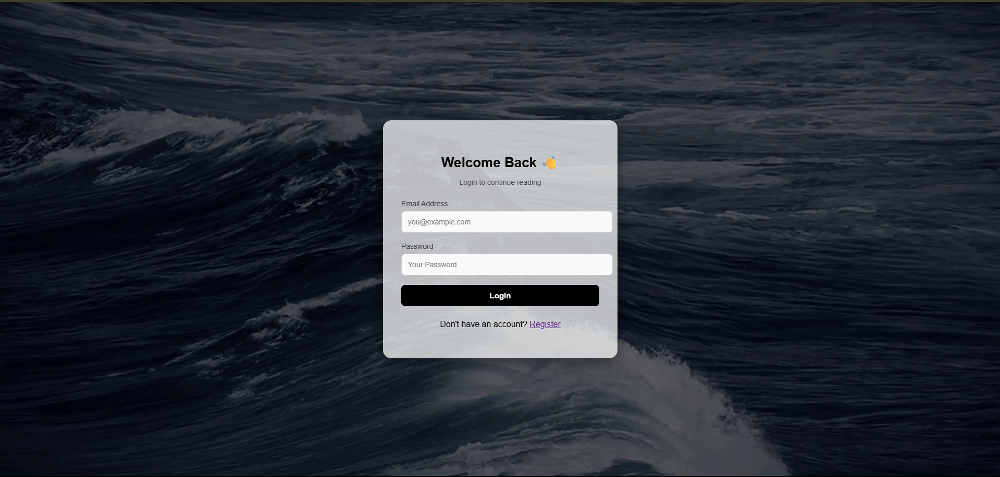

<!-- Banner -->

  

<!-- Social Links -->

  
  
  
  

---

## 🚀 Live Demo  

  

  👉 <a href="https://blog-post-wheat.vercel.app" target="_blank">Click here or LOGO to try React Posts</a>

---

## 🌟 Project Preview

  

---

## ✨ Features

- 🔐 Authentication E-Mail and Password  
- 📝 Create, view, edit, and delete posts    
- 📱 Responsive design (table + card layout for mobile)  
- 💾 LocalStorage for sessions & persistence  
- ⚡ Powered by **Vite** (super-fast build & dev)  
- 🧹 ESLint for clean & consistent code  
- 📂 Modular React components  

---

## 🛠 Tech Stack

  

- **React** – UI components    
- **Vite** – Super-fast build & dev server  
- **LocalStorage/SessionStorage** – Persistence    
- **CSS** – Clean responsive styling  

---